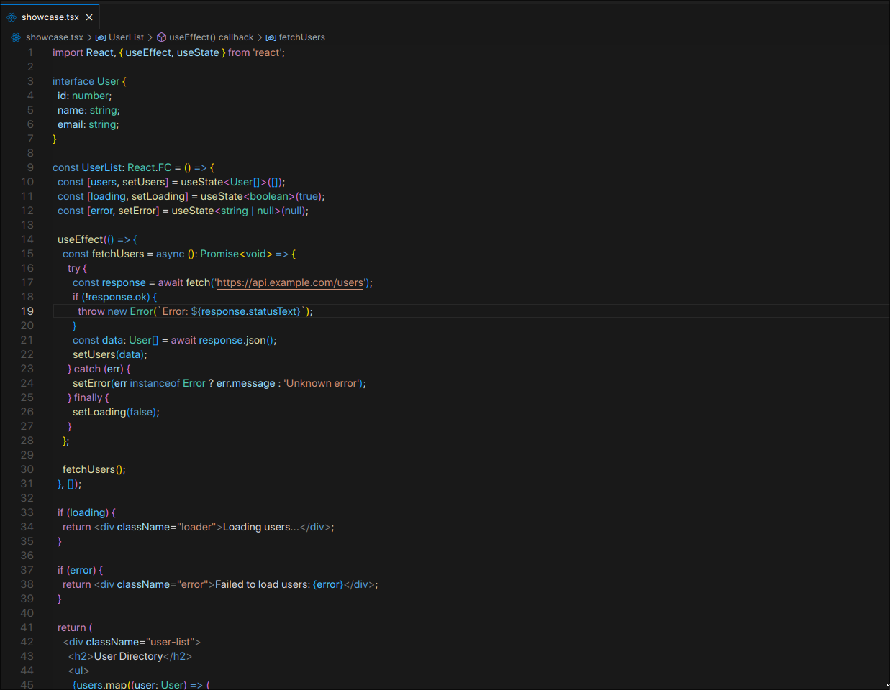

# Darkest Modern

A mixed theme combining the base colors from Anysphere Modern and the token colors from the default VSCode theme `Dark Modern`

## Installation

1. Open VSCode.
2. Navigate to the **Extensions** panel (`Ctrl+Shift+X` or `Cmd+Shift+X`).
3. Search for "**Darkest Modern**".
4. Click **Install**.
5. Reload VSCode if prompted.

## Usage

1. Press `Ctrl+K Ctrl+T` (`Cmd+K Cmd+T` on macOS) to open the theme selector.
2. Select "**Darkest Modern**" from the list.

## Sources
- [VSCode default dark themes](https://github.com/microsoft/vscode/blob/main/extensions/theme-defaults/themes)
- [Anysphere Modern](https://github.com/GustavoPrietoP/anysphere-modern)

## Contribution

Contributions are welcome! Please open an issue or submit a pull request for any enhancements or bug fixes.

## License

[MIT](LICENSE)